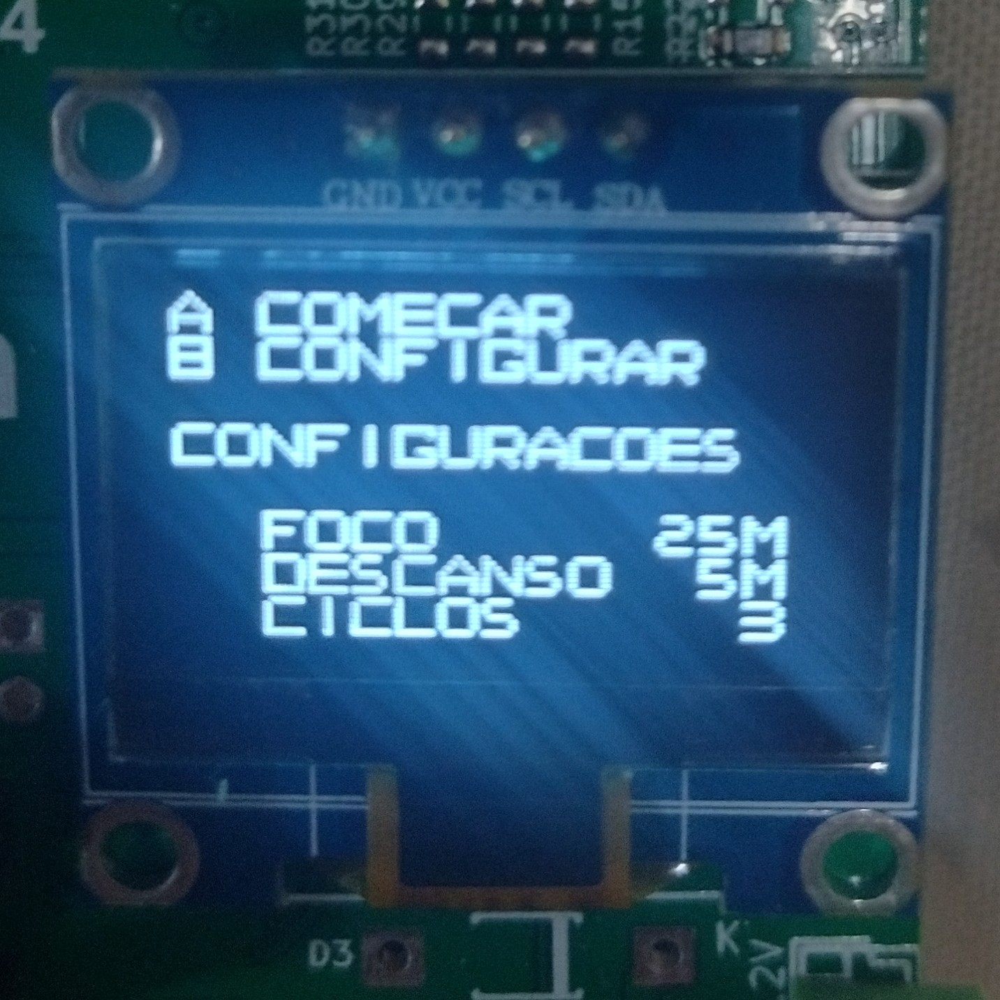
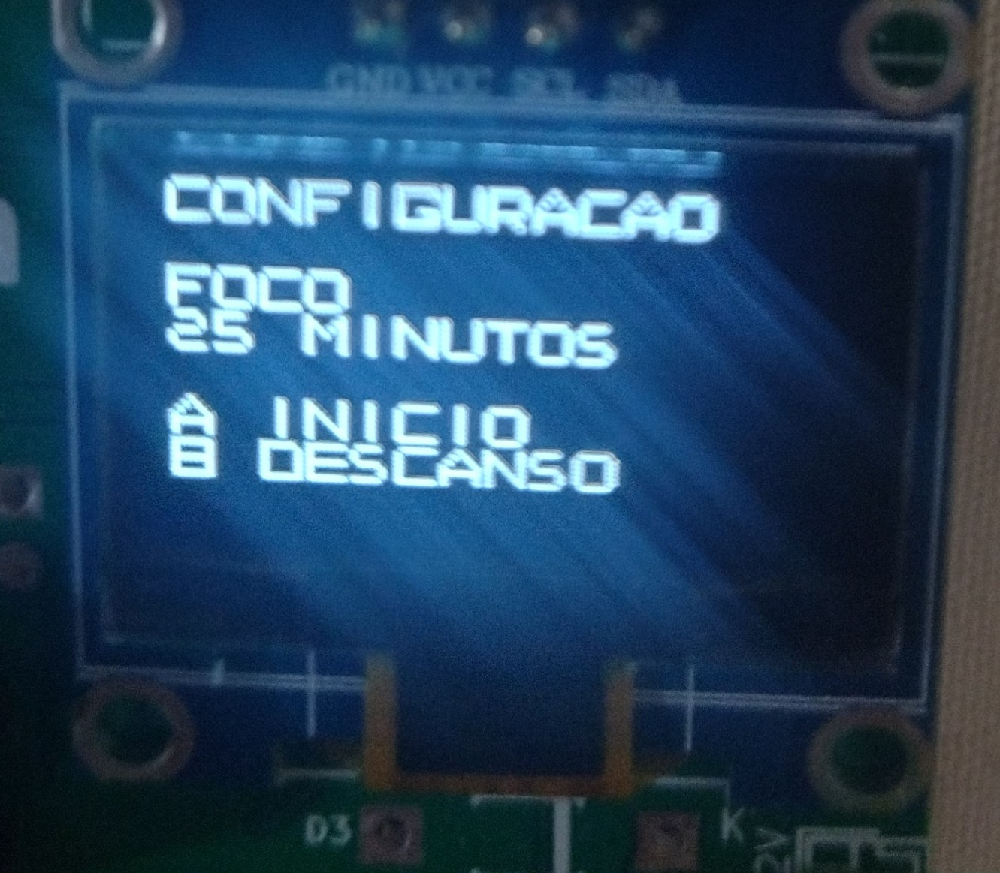
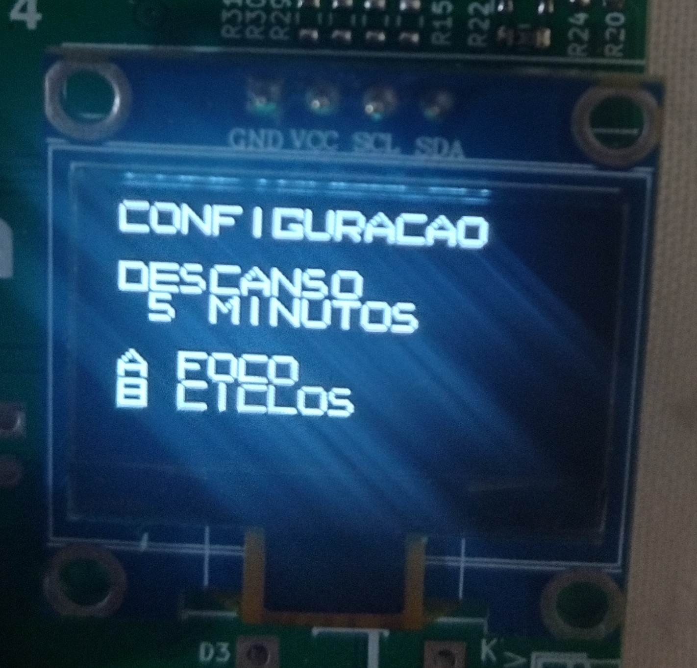
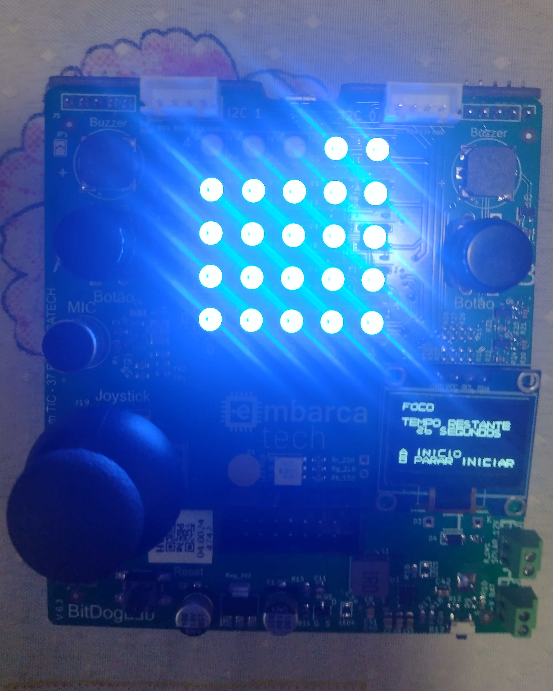
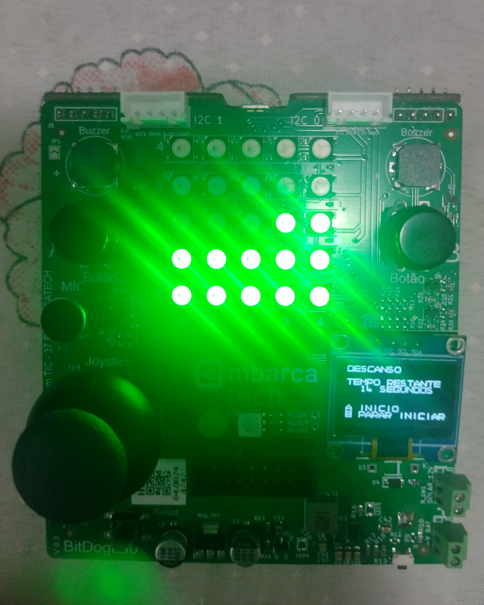

# Descrição do Projeto

Utilizando a placa BitDogLab como base, foi desensolvido um timer para a aplicação da técnica pomodoro. Este timer cronometra périodos de foco e de descanso por uma certa quantia de ciclos, sendo tanto o tempo alocado aos périodos de foco e descanso e a quantidade de ciclos determinados pelo usuário e persistidos mesmo com a placa desligada. Um vídeo demonstrativo do funcionamento do projeto pode ser visto neste [link](https://youtu.be/EQZMea6fBO4).

# Imagens de Demonstração

## Tela inicial e Telas de configuração

    
    
    
    

## Timer em Funcionamento

    
    

